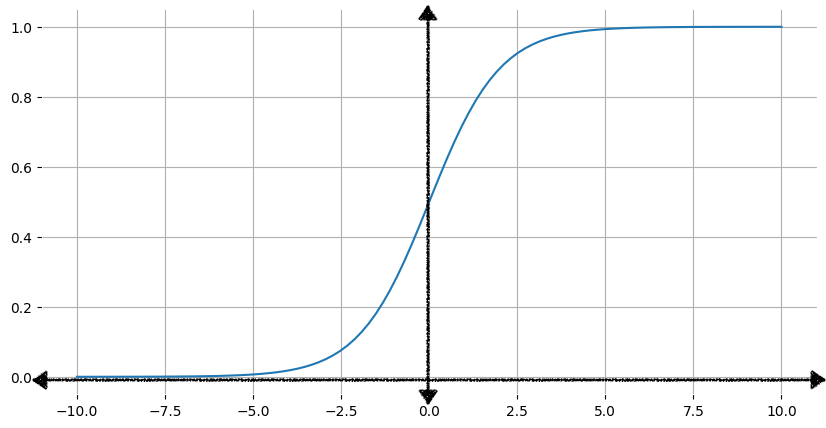
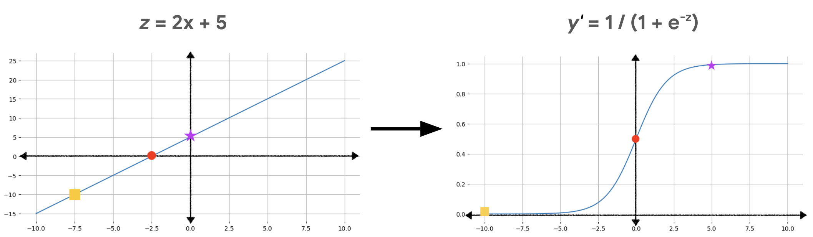

# Logistic Regression

### Tujuan Pembelajaran

1. Mengidentifikasi kasus penggunaan untuk melakukan regresi logistik.
2. Menjelaskan bagaimana model regresi logistik menggunakan **fungsi sigmoid** untuk menghitung probabilitas.
3. Membandingkan **regresi linier** dan **regresi logistik**.
4. Menjelaskan mengapa regresi logistik menggunakan **log loss** alih-alih menggunakan **squared loss**.
5. Menjelaskan pentingnya regularisasi saat melatih model regresi logistik.

#### Prasyarat: 

Modul ini mengasumsikan bahwa Anda sudah familiar dengan konsep-konsep yang dibahas dalam modul-modul berikut:

- Pengenalan Pembelajaran Mesin
- Regresi Linier

Dalam modul Regresi Linier, Anda telah menjelajahi cara membangun model untuk membuat prediksi numerik kontinu, seperti efisiensi bahan bakar mobil. Namun, bagaimana jika Anda ingin membangun model untuk menjawab pertanyaan seperti "Apakah hari ini akan hujan?" atau "Apakah email ini spam?"

Modul ini memperkenalkan jenis model regresi baru yang disebut regresi logistik, yang dirancang untuk **memprediksi probabilitas dari suatu hasil tertentu**.

## Regresi Logistik: Menghitung Probabilitas dengan Fungsi Sigmoid

Banyak masalah memerlukan estimasi probabilitas sebagai output. Regresi logistik adalah mekanisme yang sangat efisien untuk menghitung probabilitas. Secara praktis, Anda dapat menggunakan probabilitas yang menghasilkan salah satu dari dua cara berikut:

- Digunakan "apa adanya." Misalnya, jika model prediksi spam menerima email sebagai input dan menghasilkan nilai 0,932, ini mengimplikasikan probabilitas 93,2% bahwa email tersebut adalah spam.

- Dikonversi menjadi kategori biner seperti Benar atau Salah, Spam atau Tidak Spam.

Modul ini berfokus pada penggunaan output model regresi logistik apa adanya. Dalam modul Klasifikasi (clasification modul), Anda akan belajar bagaimana mengonversi output ini menjadi kategori biner.

### Sigmoid function

Anda mungkin bertanya-tanya bagaimana model regresi logistik dapat memastikan bahwa output-nya mewakili probabilitas, selalu menghasilkan nilai antara 0 dan 1. Kebetulan, ada sekumpulan fungsi yang disebut fungsi logistik yang memiliki karakteristik output yang sama. Fungsi logistik standar, yang juga dikenal sebagai fungsi sigmoid (sigmoid berarti "bentuk s" atau "s-shaped"), memiliki rumus:

<math xmlns="http://www.w3.org/1998/Math/MathML" display="block">
  <mi>f</mi>
  <mo stretchy="false">(</mo>
  <mi>x</mi>
  <mo stretchy="false">)</mo>
  <mo>=</mo>
  <mfrac>
    <mn>1</mn>
    <mrow>
      <mn>1</mn>
      <mo>+</mo>
      <msup>
        <mi>e</mi>
        <mrow class="MJX-TeXAtom-ORD">
          <mo>&#x2212;<!-- − --></mo>
          <mi>x</mi>
        </mrow>
      </msup>
    </mrow>
  </mfrac>
</math>

<br>
<br>  

Gambar 40 menunjukan menunjukkan grafik yang sesuai dari fungsi sigmoid.



Grafik fungsi sigmoid. Kurva mendekati 0 saat nilai x menurun menuju negatif tak terhingga, dan mendekati 1 saat nilai x meningkat menuju tak terhingga.

Saat input, x, meningkat, output dari fungsi sigmoid mendekati tetapi tidak pernah mencapai 1. Demikian pula, saat input menurun, output fungsi sigmoid mendekati tetapi tidak pernah mencapai 0.

Tabel di bawah ini menunjukkan nilai output dari fungsi sigmoid untuk nilai input dalam rentang -7 hingga 7. Perhatikan betapa cepatnya fungsi sigmoid mendekati 0 untuk nilai input negatif yang menurun, dan betapa cepatnya fungsi sigmoid mendekati 1 untuk nilai input positif yang meningkat.

Namun, tidak peduli seberapa besar atau seberapa kecil nilai inputnya, outputnya akan selalu lebih besar dari 0 dan kurang dari 1.

| Input | Sigmoid Output |
|-------|----------------|
| -7    | 0.001          |
| -6    | 0.002          |
| -5    | 0.007          |
| -4    | 0.018          |
| -3    | 0.047          |
| -2    | 0.119          |
| -1    | 0.269          |
| 0     | 0.500          |
| 1     | 0.731          |
| 2     | 0.881          |
| 3     | 0.952          |
| 4     | 0.982          |
| 5     | 0.993          |
| 6     | 0.997          |
| 7     | 0.999          |


#### Mengubah output linier menggunakan fungsi sigmoid

Persamaan berikut mewakili komponen linier dari model regresi logistik: 

<math xmlns="http://www.w3.org/1998/Math/MathML" display="block">
  <mi>z</mi>
  <mo>=</mo>
  <mi>b</mi>
  <mo>+</mo>
  <msub>
    <mi>w</mi>
    <mn>1</mn>
  </msub>
  <msub>
    <mi>x</mi>
    <mn>1</mn>
  </msub>
  <mo>+</mo>
  <msub>
    <mi>w</mi>
    <mn>2</mn>
  </msub>
  <msub>
    <mi>x</mi>
    <mn>2</mn>
  </msub>
  <mo>+</mo>
  <mo>&#x2026;<!-- … --></mo>
  <mo>+</mo>
  <msub>
    <mi>w</mi>
    <mi>N</mi>
  </msub>
  <msub>
    <mi>x</mi>
    <mi>N</mi>
  </msub>
</math>

<br>

Di mana:

- z adalah output dari persamaan linier, yang juga disebut log odds.
- b adalah bias.
- Nilai w adalah bobot yang dipelajari oleh model.
- Nilai x adalah nilai fitur untuk contoh tertentu.

Untuk mendapatkan prediksi regresi logistik, nilai z kemudian diteruskan ke fungsi sigmoid, menghasilkan nilai (sebuah probabilitas) antara 0 dan 1:

<math xmlns="http://www.w3.org/1998/Math/MathML" display="block">
  <msup>
    <mi>y</mi>
    <mo>&#x2032;</mo>
  </msup>
  <mo>=</mo>
  <mfrac>
    <mn>1</mn>
    <mrow>
      <mn>1</mn>
      <mo>+</mo>
      <msup>
        <mi>e</mi>
        <mrow class="MJX-TeXAtom-ORD">
          <mo>&#x2212;<!-- − --></mo>
          <mi>z</mi>
        </mrow>
      </msup>
    </mrow>
  </mfrac>
</math>

<br>

di mana:

- y' adalah output dari model regresi logistik.
- z adalah output linier (seperti yang dihitung dalam persamaan sebelumnya).

Gambar 2 mengilustrasikan bagaimana output linier diubah menjadi output regresi logistik menggunakan perhitungan-perhitungan tersebut.



Gambar 2. Kiri: grafik dari fungsi linier z = 2x + 5, dengan tiga titik yang disorot. Kanan: kurva sigmoid dengan tiga titik yang sama disorot setelah diubah oleh fungsi sigmoid.

Dalam Gambar 2, sebuah persamaan linier menjadi input untuk fungsi sigmoid, yang membengkokkan garis lurus menjadi bentuk huruf s. Perhatikan bahwa persamaan linier dapat menghasilkan nilai z yang sangat besar atau sangat kecil, tetapi output dari fungsi sigmoid, y', selalu berada di antara 0 dan 1, tidak termasuk. Misalnya, kotak kuning pada grafik di sebelah kiri memiliki nilai z sebesar –10, tetapi fungsi sigmoid pada grafik di sebelah kanan memetakan –10 menjadi nilai y' sebesar 0.00004.

##### Latihan:

Model regresi logistik dengan tiga fitur memiliki bias dan bobot sebagai berikut:

<math xmlns="http://www.w3.org/1998/Math/MathML" display="block">
  <mtable columnalign="right left right left right left right left right left right left" rowspacing="3pt" columnspacing="0em 2em 0em 2em 0em 2em 0em 2em 0em 2em 0em" displaystyle="true">
    <mtr>
      <mtd>
        <mi>b</mi>
      </mtd>
      <mtd>
        <mi></mi>
        <mo>=</mo>
        <mn>1</mn>
      </mtd>
    </mtr>
    <mtr>
      <mtd>
        <msub>
          <mi>w</mi>
          <mn>1</mn>
        </msub>
      </mtd>
      <mtd>
        <mi></mi>
        <mo>=</mo>
        <mn>2</mn>
      </mtd>
    </mtr>
    <mtr>
      <mtd>
        <msub>
          <mi>w</mi>
          <mn>2</mn>
        </msub>
      </mtd>
      <mtd>
        <mi></mi>
        <mo>=</mo>
        <mo>&#x2212;<!-- − --></mo>
        <mn>1</mn>
      </mtd>
    </mtr>
    <mtr>
      <mtd>
        <msub>
          <mi>w</mi>
          <mn>3</mn>
        </msub>
      </mtd>
      <mtd>
        <mi></mi>
        <mo>=</mo>
        <mn>5</mn>
      </mtd>
    </mtr>
  </mtable>
</math>

Diberikan nilai input berikut:

x1 = 0, 
x2 = 10,
x3 = 2

Jawablah dengan 2 pertanyaan dibawah ini:

1. What is the value of z for these input values?

- –1
- 0
- 0.731
- 1

2. What is the logistic regression prediction for these input values?

- 0.268
- 0.5
- 0.731
- 1

Untuk menjawab pertanyaan ini, kita perlu menghitung nilai ( z ) dan prediksi regresi logistik berdasarkan model yang diberikan.

Langkah 1: Menghitung nilai ( z )
Rumus untuk menghitung ( z ) dalam regresi logistik adalah:

[ z = b + w_1 \cdot x_1 + w_2 \cdot x_2 + w_3 \cdot x_3 ]

Dari informasi yang diberikan, kita memiliki:

- Bias ( b = 1 )
- Bobot ( w_1 = 2 )
- Bobot ( w_2 = -1 )
- Bobot ( w_3 = 5 )

Dan nilai input:

- ( x_1 = 0 )
- ( x_2 = 10 )
- ( x_3 = 2 )

Sekarang, kita substitusi nilai-nilai ini ke dalam rumus:

`[ z = 1 + (2 \cdot 0) + (-1 \cdot 10) + (5 \cdot 2) ]`

Mari kita hitung langkah demi langkah:

```
( 2 \cdot 0 = 0 )
( -1 \cdot 10 = -10 )
( 5 \cdot 2 = 10 )
```

Sekarang substitusi kembali ke dalam rumus:

`[ z = 1 + 0 - 10 + 10 ] [ z = 1 + 0 = 1 ]`

Jadi, nilai ( z ) untuk nilai input ini adalah 1.

Langkah 2: Menghitung prediksi regresi logistik
Prediksi regresi logistik dihitung menggunakan fungsi sigmoid:

```
[ \text{prediksi} = \frac{1}{1 + e^{-z}} ]

Dengan ( z = 1 ):

[ \text{prediksi} = \frac{1}{1 + e^{-1}} ]

Kita tahu bahwa ( e^{-1} \approx 0.3679 ):

[ \text{prediksi} = \frac{1}{1 + 0.3679} \approx \frac{1}{1.3679} \approx 0.731 ]
```

Jadi, prediksi regresi logistik untuk nilai input ini adalah 0.731.

**Kesimpulan**

Nilai ( z ) untuk nilai input ini adalah 1.
Prediksi regresi logistik untuk nilai input ini adalah 0.731.

## Logistic regression: Loss and regularization

**Model regresi logistik (Logistic regression)** dilatih menggunakan proses yang sama seperti model regresi linier, dengan dua perbedaan kunci:

- Model regresi logistik menggunakan **Log Loss** sebagai fungsi kerugian, bukan **kuadrat kerugian**.

- Menerapkan **regularisasi** sangat penting untuk mencegah overfitting.

Bagian berikut membahas dua pertimbangan ini dengan lebih mendalam.

### Log Loss

Dalam **modul regresi linier**, Anda menggunakan **kuadrat kerugian** (juga disebut kerugian L2) sebagai fungsi kerugian. Kuadrat kerugian bekerja dengan baik untuk model linier di mana laju perubahan nilai output adalah konstan. Misalnya, dengan model linier `y' = b + 3x1`, setiap kali Anda menambah nilai input sebesar 1, nilai output meningkat sebesar 3.

Namun, laju perubahan **model regresi logistik** tidak konstan. Seperti yang Anda lihat dalam Perhitungan probabilitas, kurva sigmoid berbentuk **s** dan bukan **linier**. Ketika nilai log-odds (z) mendekati 0, peningkatan kecil dalam nilai input (z) menghasilkan perubahan yang jauh lebih besar pada output (y), dibandingkan ketika nilai input (z) adalah angka positif atau negatif yang besar. Tabel berikut menunjukkan output fungsi sigmoid untuk nilai input dari 5 hingga 10, serta ketelitian yang diperlukan untuk menangkap perbedaan dalam hasil.

| Input | Logistic Output | Required Digits of Precision |
|-------|------------------|------------------------------|
| 5     | 0.993            | 3                            |
| 6     | 0.997            | 3                            |
| 7     | 0.999            | 3                            |
| 8     | 0.9997           | 4                            |
| 9     | 0.9999           | 4                            |
| 10    | 0.99998          | 5                            |

<br>

Jika Anda menggunakan kuadrat kerugian untuk menghitung kesalahan pada fungsi sigmoid, saat output semakin mendekati 0 dan 1, Anda akan membutuhkan lebih banyak memori untuk mempertahankan ketelitian yang diperlukan untuk melacak nilai-nilai ini.

Sebagai gantinya, fungsi kerugian untuk regresi logistik adalah Log Loss. Persamaan Log Loss mengembalikan logaritma dari besarnya perubahan, bukan hanya jarak dari data ke prediksi. Log Loss dihitung sebagai berikut:

<math xmlns="http://www.w3.org/1998/Math/MathML">
  <mtext>Log Loss</mtext>
  <mo>=</mo>
  <munder>
    <mo>&#x2211;<!-- ∑ --></mo>
    <mrow class="MJX-TeXAtom-ORD">
      <mo stretchy="false">(</mo>
      <mi>x</mi>
      <mo>,</mo>
      <mi>y</mi>
      <mo stretchy="false">)</mo>
      <mo>&#x2208;<!-- ∈ --></mo>
      <mi>D</mi>
    </mrow>
  </munder>
  <mo>&#x2212;<!-- − --></mo>
  <mi>y</mi>
  <mi>log</mi>
  <mo>&#x2061;<!-- ⁡ --></mo>
  <mo stretchy="false">(</mo>
  <msup>
    <mi>y</mi>
    <mo>&#x2032;</mo>
  </msup>
  <mo stretchy="false">)</mo>
  <mo>&#x2212;<!-- − --></mo>
  <mo stretchy="false">(</mo>
  <mn>1</mn>
  <mo>&#x2212;<!-- − --></mo>
  <mi>y</mi>
  <mo stretchy="false">)</mo>
  <mi>log</mi>
  <mo>&#x2061;<!-- ⁡ --></mo>
  <mo stretchy="false">(</mo>
  <mn>1</mn>
  <mo>&#x2212;<!-- − --></mo>
  <msup>
    <mi>y</mi>
    <mo>&#x2032;</mo>
  </msup>
  <mo stretchy="false">)</mo>
</math>

Dimana:

<math xmlns="http://www.w3.org/1998/Math/MathML">
  <mo stretchy="false">(</mo>
  <mi>x</mi>
  <mo>,</mo>
  <mi>y</mi>
  <mo stretchy="false">)</mo>
  <mo>&#x2208;<!-- ∈ --></mo>
  <mi>D</mi>
</math> adalah dataset yang berisi banyak contoh berlabel, yang merupakan pasangan (x, y).

<br>

`y` adalah label dalam contoh berlabel. Karena ini adalah regresi logistik, setiap nilai dari `y` haruslah 0 atau 1.

`y'` adalah prediksi model Anda (di antara 0 dan 1), berdasarkan sekumpulan fitur dalam x.

## Regularization in logistic regression

**Regularization** adalah mekanisme untuk memberikan penalti pada kompleksitas model selama pelatihan, sangat penting dalam pemodelan **regresi logistik**. Tanpa regularisasi, sifat asimptotik dari regresi logistik akan terus mendorong kehilangan (loss) menuju 0 dalam kasus di mana model memiliki sejumlah besar fitur. Oleh karena itu, sebagian besar model regresi logistik menggunakan salah satu dari dua strategi berikut untuk mengurangi kompleksitas model:

- L2 regularization
- Early stopping: Limiting the number of training steps to halt training while loss is still decreasing.

> Catatan: Anda akan belajar lebih banyak tentang regularisasi di modul **Dataset, Generalisasi, dan Overfitting** dalam kursus ini.

<br>

## Logistic Regression: Test Your Knowledge

1. Why is a linear regression model's output a poor predictor of probability?
- It only has one weight per feature.
- It only has one output value.
- The bias parameter skews the output value.
- Its predictions are not restricted to values between 0 and 1.

2. True or false: A sigmoid function never outputs the value 0 or the value 1.
- True
- False

3. True or false: Applying regularization is less important when training logistic regression models than it is for training linear regression models.
- True
- False

4. Which of the following options matches both Linear Regression and Logistic Regression with appropriate loss functions for calculating loss?
- Linear Regression: Mean squared error
- Logistic Regression: Mean squared error
<br>
- Linear Regression: Mean squared error
- Logistic Regression: Mean absolute error
<br>
- Linear Regression: Mean squared error
- Logistic Regression: Log Loss
<br>
- Linear Regression: Log Loss
- Logistic Regression: Mean squared error

5. Which of the following is an effective regularization technique for logistic regression models?
- Dropout regularization
- Late stopping
- Early stopping
- Gradient descent

### Jawaban Gemini: 

**Here are the answers and explanations:**

**1. Why is a linear regression model's output a poor predictor of probability?**
* **Its predictions are not restricted to values between 0 and 1.** 
   - Linear regression models can output any real number, which doesn't directly correspond to probabilities. Probabilities, on the other hand, are bounded between 0 and 1. 

**2. True or false: A sigmoid function never outputs the value 0 or the value 1.**
* **True** 
   - The sigmoid function is designed to map any real number to a value between 0 and 1, but it asymptotically approaches these values without ever reaching them.

**3. True or false: Applying regularization is less important when training logistic regression models than it is for training linear regression models.**
* **False** 
   - Regularization is important for both linear and logistic regression models to prevent overfitting. It helps to reduce the complexity of the model and improve its generalization performance.

**4. Which of the following options matches both Linear Regression and Logistic Regression with appropriate loss functions for calculating loss?**
* **Linear Regression: Mean squared error**
* **Logistic Regression: Log Loss**
   - Mean squared error is commonly used for linear regression as it measures the average squared difference between predicted and actual values. Log loss is suitable for logistic regression as it penalizes incorrect predictions more heavily, especially for confident incorrect predictions.

**5. Which of the following is an effective regularization technique for logistic regression models?**
* **Early stopping** 
   - Early stopping is a technique that stops the training process before the model overfits the training data. It's a simple and effective regularization technique for logistic regression. Dropout, while effective for neural networks, is not typically used for logistic regression. Late stopping is not a standard regularization technique. Gradient descent is an optimization algorithm, not a regularization technique.


