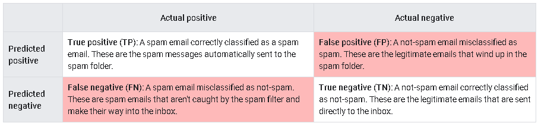

# Classification

#### Tujuan Pembelajaran: 

- Menentukan ambang batas yang sesuai untuk model klasifikasi biner. 
- Menghitung dan memilih metrik yang tepat untuk mengevaluasi model klasifikasi biner. 
- Menginterpretasikan ROC dan AUC.

**Prasyarat**: 

Modul ini mengasumsikan bahwa Anda sudah familiar dengan konsep-konsep yang dibahas dalam modul-modul berikut:

- Pengenalan Machine learning 
- Regresi Linier 
- Regresi Logistik

Dalam modul **Regresi Logistik**, Anda telah belajar bagaimana menggunakan fungsi **sigmoid** untuk mengubah output model mentah menjadi nilai antara 0 dan 1 untuk membuat prediksi probabilistik, misalnya memprediksi bahwa sebuah email memiliki kemungkinan 75% adalah spam. Namun, bagaimana jika tujuan Anda bukan untuk menghasilkan probabilitas tetapi membuat kategori, misalnya memprediksi apakah sebuah email adalah "spam" atau "bukan spam"?

Clasification (Klasifikasi) adalah tugas untuk memprediksi kelas atau kategori mana dari sekumpulan kelas yang dimiliki oleh sebuah contoh. Dalam modul ini, Anda akan belajar bagaimana mengubah model **regresi logistik** yang memprediksi probabilitas menjadi **model klasifikasi biner** yang memprediksi salah satu dari dua kelas. Anda juga akan belajar bagaimana memilih dan menghitung metrik yang tepat untuk mengevaluasi kualitas prediksi model klasifikasi (clasification). Terakhir, Anda akan mendapatkan pengantar singkat tentang masalah klasifikasi multi-kelas (multiclass clasification), yang akan dibahas lebih dalam di kemudian hari dalam kursus ini.

### Thresholds dan confusion matrix

Misalkan Anda memiliki **model regresi logistik** untuk deteksi email spam yang memprediksi nilai antara 0 dan 1, yang mewakili probabilitas bahwa sebuah email tertentu adalah spam. Sebuah prediksi sebesar 0,50 menunjukkan kemungkinan 50% bahwa email tersebut adalah spam, sedangkan prediksi sebesar 0,75 menunjukkan kemungkinan 75% bahwa email tersebut adalah spam, dan seterusnya.

Anda ingin mengimplementasikan model ini dalam aplikasi email untuk memfilter spam ke folder surat yang terpisah. Namun, untuk melakukannya, Anda perlu mengubah output numerik mentah model (misalnya, 0,75) menjadi salah satu dari dua kategori: "spam" atau "bukan spam".

Untuk melakukan konversi ini, Anda memilih nilai ambang probabilitas, yang disebut sebagai threshold klasifikasi. Contoh dengan probabilitas di atas nilai ambang ini kemudian ditugaskan ke kelas positif, yaitu kelas yang sedang Anda uji (dalam hal ini, spam). Contoh dengan probabilitas yang lebih rendah akan ditugaskan ke kelas negatif, yaitu kelas alternatif (dalam hal ini, tidak spam).

Anda mungkin bertanya-tanya: apa yang terjadi jika skor yang diprediksi sama dengan ambang klasifikasi (misalnya, skor 0,5 di mana ambang klasifikasi juga 0,5)? Penanganan untuk kasus ini tergantung pada implementasi tertentu yang dipilih untuk model klasifikasi. Misalnya, library ""Keras" memprediksi kelas negatif jika skor dan ambang sama, tetapi alat atau kerangka kerja lain mungkin menangani kasus ini dengan cara yang berbeda.

Misalkan model memberikan skor satu email sebesar 0,99, memprediksi bahwa email tersebut memiliki 99% kemungkinan menjadi spam, dan email lainnya sebesar 0,51, memprediksi bahwa email tersebut memiliki 51% kemungkinan menjadi spam. Jika Anda menetapkan ambang klasifikasi pada 0,5 model akan mengklasifikasikan kedua email tersebut sebagai spam. Namun, jika Anda menetapkan ambang pada 0,95, hanya email yang mendapatkan skor 0,99 yang akan dikategorikan sebagai spam.

Meskipun 0,5 mungkin terlihat seperti ambang yang intuitif, ini bukan ide yang baik jika biaya dari satu jenis klasifikasi yang salah lebih besar daripada yang lain, atau jika kelas-kelas tersebut tidak seimbang. Jika hanya 0,01% dari email adalah spam, atau jika salah mengklasifikasikan email yang sah lebih buruk daripada membiarkan spam masuk ke kotak masuk, memberi label pada apa pun yang dianggap model setidaknya 50% kemungkinan menjadi spam sebagai spam dapat menghasilkan hasil yang tidak diinginkan.

### confusion matrix

Skor probabilitas bukanlah kenyataan atau kebenaran yang mendasar. Ada empat kemungkinan hasil untuk setiap keluaran dari pengklasifikasi biner. Untuk contoh pengklasifikasi spam, jika Anda menyusun kebenaran yang mendasar sebagai kolom dan prediksi model sebagai baris, tabel berikut, yang disebut matriks kebingungan (confusion matrix), adalah hasilnya:

Perhatikan bahwa total di setiap baris memberikan semua prediksi positif (TP + FP) dan semua prediksi negatif (FN + TN), terlepas dari validitasnya. Sementara itu, total di setiap kolom memberikan semua positif nyata (TP + FN) dan semua negatif nyata (FP + TN) terlepas dari klasifikasi model.

Ketika total positif aktual tidak mendekati total negatif aktual, dataset tersebut tidak seimbang. Sebuah contoh dari dataset yang tidak seimbang mungkin adalah sekumpulan ribuan foto awan, di mana jenis awan langka yang Anda minati, misalnya, awan volutus, hanya muncul beberapa kali.

### Effect of threshold on true and false positives and negatives

