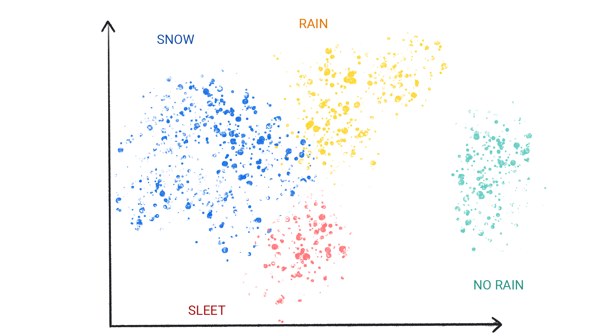

# Belajar cepat Machine Learning

Jalur cepat, praktek  dan pengenalan Machine Learning (ML).

Referens :

- Google dev: https://developers.google.com/machine-learning/intro-to-ml
- Linear Regression in Python| Simple Regression, Multiple Regression, Ridge Regression, Lasso and subset selection also : https://www.udemy.com/course/machine-learning-basics-building-regression-model-in-python/learn/lecture/13995642#overview
- Machine Learning Crash Course: https://developers.google.com/machine-learning/crash-course

## Pengenalan Machine Learning

Selamat datang di Pengenalan Machine Learning! Kursus ini memperkenalkan konsep-konsep Machine Learning (ML). 

**Objectif belajar** : 

- Memahami perbedaan tipe machine learning.
- Memahami key konsep dari supervised machine learning.
- Belajar bagaimana memecahkan masalah dengan menggunakan machine learning yang berbeda dari cara tradisional sebelumnya.

### Apa itu Machine Learning?

Machine learning (ML) mendukung beberapa teknologi terpenting yang kita gunakan, mulai dari aplikasi terjemahan hingga kendaraan tanpa awak. Kursus ini menjelaskan konsep-konsep dasar di balik ML.

ML menawarkan cara baru untuk memecahkan masalah, menjawab pertanyaan kompleks, dan menciptakan konten baru. ML dapat memprediksi cuaca, memperkirakan waktu perjalanan, merekomendasikan lagu, menyelesaikan kalimat secara otomatis, merangkum artikel, dan menghasilkan gambar yang belum pernah dilihat sebelumnya.

Secara sederhana, ML adalah proses melatih sebuah perangkat lunak, yang disebut model, untuk membuat prediksi yang berguna atau menghasilkan konten dari data.

Sebagai contoh, anggaplah kita ingin membuat aplikasi untuk memprediksi curah hujan. Kita dapat menggunakan pendekatan tradisional atau pendekatan ML. Dengan pendekatan tradisional, kita akan membuat representasi berbasis fisika dari atmosfer dan permukaan Bumi, menghitung sejumlah besar persamaan dinamika fluida. Ini sangat sulit.

Dengan pendekatan ML, kita akan memberikan model ML sejumlah besar data cuaca hingga model ML tersebut akhirnya mempelajari hubungan matematis antara pola cuaca yang menghasilkan jumlah hujan yang berbeda. Kita kemudian akan memberikan data cuaca saat ini kepada model, dan model tersebut akan memprediksi jumlah hujan.

### Jenis ML System 

ML dibagi menjadi 3 jenis categori berdasar pada bagaimana ML belajar untuk memberikan prediksi atau generate konten.

**1. Supervised Learning**: ML belajar dari data yang telah diberi label atau di kategorikan.

**2. Unsupervised Learning**: ML belajar dari data yang tidak diberi label atau di kategorikan sebelumnya.

**3. Reinforcement Learning**: ML belajar dari pengalaman dan penghargaan atau hukuman.

**4. Generative AI**: ML belajar untuk menghasilkan konten baru berdasarkan data yang ada.

### 1. Supervised Learning

Supervised Learning dapat membuat prediksi setelah melihat banyak data yang disertai dengan jawaban yang benar, kemudian menemukan hubungan antara elemen-elemen dalam data yang menghasilkan jawaban yang benar. 

Ini mirip dengan seorang siswa yang mempelajari materi baru dengan mempelajari ujian-ujian lama yang berisi pertanyaan dan jawaban. Setelah siswa tersebut berlatih dengan cukup banyak ujian lama, ia siap dengan baik untuk menghadapi ujian baru. Sistem pembelajaran mesin ini disebut "supervised" dalam arti bahwa seorang manusia memberikan data kepada sistem pembelajaran mesin dengan hasil yang benar yang sudah diketahui.

Yang paling terbanyak digunakan untuk Supervised Learning, adalah: 

**1. Regression**. 
**2. Classification**.

#### 1. Regression

Regression model digunakan untuk memprediksi Nilai, contoh, model cuaca yang dapat memprediksi jumlah curah hujan, dalam inchi atau milimiter, itu adalah contoh dari model regresi.

Contoh regression model lainnya: 

| Skenario             | Data Input yang Mungkin                                                                                                   | Prediksi Numerik                           |
|----------------------|--------------------------------------------------------------------------------------------------------------------------|--------------------------------------------|
| Harga rumah masa depan| Luas bangunan, kode pos, jumlah kamar tidur dan kamar mandi, ukuran tanah, suku bunga hipotek, tarif pajak properti, biaya konstruksi, dan jumlah rumah yang dijual di daerah tersebut. | Harga rumah.                               |
| Waktu perjalanan masa depan | Kondisi lalu lintas historis (diperoleh dari smartphone, sensor lalu lintas, aplikasi ride-hailing, dan aplikasi navigasi lainnya), jarak ke tujuan, dan kondisi cuaca. | Waktu dalam menit dan detik untuk tiba di tujuan. |

#### 2. Clasification 

Model klasifikasi (clasification) memprediksi kemungkinan bahwa, serangkaian data bisa termasuk dalam suatu kategori. Berbeda dengan model regresi, yang outputnya adalah angka, model klasifikasi mengeluarkan nilai yang menyatakan apakah sesuatu termasuk dalam kategori tertentu atau tidak. Misalnya, model klasifikasi digunakan untuk memprediksi apakah sebuah email adalah spam atau apakah sebuah foto terdapat kucing.

Model klasifikasi dibagi menjadi dua kelompok: **klasifikasi biner** dan **klasifikasi multikelas**. Model klasifikasi biner mengeluarkan nilai dari kelas yang hanya memiliki dua nilai, misalnya, model yang mengeluarkan nilai hujan atau tidak hujan. Model klasifikasi multikelas mengeluarkan nilai dari kelas yang memiliki lebih dari dua nilai, misalnya, model yang dapat mengeluarkan nilai hujan, hujan es, salju, atau hujan gerimis.

**Clasification Binary atau Multiclas**

Model klasifikasi dibagi menjadi dua kelompok: klasifikasi biner dan klasifikasi multikelas. Model klasifikasi biner menghasilkan nilai dari sebuah kelas yang hanya memiliki dua nilai, misalnya, model yang menghasilkan output hujan atau tidak hujan. Model klasifikasi multikelas menghasilkan nilai dari sebuah kelas yang memiliki lebih dari dua nilai, misalnya, model yang dapat menghasilkan output hujan, hujan es, salju, atau hujan gerimis.

#### 2. Unsupervised Learning

Unsupervised learning model membuat prediksi dengan memberikan data yang tidak disertai dengan jawaban benar. Goal dari unsupervised learning adalah untuk identifikasi pola antar data. Dengan kata lain model tidak memiliki petunjuk bagaimana untuk mengklasifikasikan data, model harus menemukan cara untuk mengklasifikasikan data sendiri secara mandiri.

Sebuah model unsupervised umum digunakan menerapkan teknik yang disebut pengelompokan (clustering). Model ini menemukan titik data yang menandai pengelompokan alami.

Figure 1. An ML model clustering similar data points (Sebuah model ML yang mengelompokkan titik data yang serupa)

Figure 2. Groups of clusters with natural demarcations ( Kelompok-kelompok kluster dengan demarkasi alami)

Pengelompokan (clustering) berbeda dari klasifikasi (clasification) karena kategori-kategorinya tidak ditentukan oleh Anda. Misalnya, sebuah model unsupervised mengelompokkan dataset cuaca berdasarkan suhu, mengungkapkan segmentasi yang mendefinisikan musim-musim. Anda kemudian dapat mencoba memberi nama pada kelompok-kelompok tersebut berdasarkan pemahaman Anda terhadap dataset.

Figure 3. (Sebuah model ML yang mengelompokkan pola cuaca yang serupa).

#### 3. Reinforcement Learning

Reinforcement Learning models membuat prediksi dengan mendapatkan rewards atau penalti atas aksi performa pada lingkungan. Sebuah reinforcement learning sistem menghasilkan suatu kebijakan yang mendefinisikan strategi terbaik untuk mendapatkan imbalan sebanyak mungkin.

Reinforcement Learning digunakan untuk melatih robot agar melakukan tugas, seperti berjalan di sekitar ruangan, dan program perangkat lunak seperti AlphaGo untuk bermain permainan Go.

#### 4. Generatif AI

Generatif AI adalah class dari model yang membuat content dari user input. Contoh generatif AI dapat membuat unique images, komposisi musik dan jokes, dapat menyimpulkan artikel, menjelaskan performa sebuah tugas atau mengedit photo.

Generative AI dapat menerima variasi input dan membuat berbagai output, seperti text, image, audio, dan video. Dan juga membuat kombinasi dari itu. Contoh, model dapat mengambil image sebagai input dan membuat sebuah image dan text sebagai output atau mengambail image dan text sebagai input dan membuat video sebagai output.

Generatif model dengan input dan output, seperti:
- Text-to-text
- Text-to-image
- Text-to-vidio
- Text-to-code
- Text-to-speech
- Image and text-to-image

## Supervised Learning

Supervised learning task terdefinisi dengan baik dan dapat diterapkan pada berbagai skenario—seperti mengidentifikasi spam atau memprediksi curah hujan.

### Fondasi supervised learning konsep

- Data.
- Model.
- Training.
- Evaluasi.
- Inferense (Kesimpulan)

### Data

Data adalah kekuatan pendorong dari Machine Learning (ML). Data hadir dalam bentuk kata-kata dan angka yang disimpan dalam tabel, atau sebagai nilai piksel dan gelombang yang ditangkap dalam gambar dan file audio. Kami menyimpan data yang terkait dalam dataset. Sebagai contoh, kami mungkin memiliki dataset sebagai berikut:

- Gambar dari sekumpulan kucing.
- Daftar harga rumah rumah.
- Informasi Data cuaca.

**Dataset** adalah kumpulan dari individual contoh yang memuat fitur-fitur dan label. Contoh seperti pada garis dan kolom pada spreadsheet. Fitur-fitur adalah nilai - nilai supervised model gunakan untuk prediksi label. Label adalah jawaban dari nilai-nilai (value) yang akan diprediksi oleh model. Contoh pada model cuaca memprediksi curah hujan, fiturs nya bisa jadi adalah latitude, longitude, temperatur, kelembapan, cloud coverage (cakupan awan), arah angin dan tekanan atmosfir. Label bisa sebagai jumlah curah hujan.Contoh: 

Sebaliknya, contoh yang tidak terlabel, mengandung fitur tetapi tidak ada label. Setelah Anda membuat model, model tersebut memprediksi label berdasarkan fitur yang ada.

### Karakteristik Dataset

Sebuah dataset ditandai oleh ukuran dan keragamannya. Ukuran menunjukkan jumlah contoh. Keragaman menunjukkan rentang yang dicakup oleh contoh-contoh tersebut. Dataset yang baik adalah yang besar dan sangat beragam.

Beberapa dataset memiliki ukuran yang besar dan keragaman yang tinggi. Namun, ada juga dataset yang besar tetapi memiliki keragaman rendah, dan ada yang kecil tetapi sangat beragam. Dengan kata lain, sebuah dataset yang besar tidak menjamin keragaman yang cukup, dan sebuah dataset yang sangat beragam tidak menjamin jumlah contoh yang cukup.

Sebagai contoh, sebuah dataset mungkin berisi data selama 100 tahun, tetapi hanya untuk bulan Juli. Menggunakan dataset ini untuk memprediksi curah hujan di bulan Januari akan menghasilkan prediksi yang buruk. Sebaliknya, sebuah dataset mungkin mencakup hanya beberapa tahun tetapi mencakup setiap bulan. Dataset ini mungkin menghasilkan prediksi yang buruk karena tidak memiliki cukup tahun untuk mempertimbangkan variabilitas.

Sebuah dataset juga dapat ditandai oleh jumlah fiturnya. Sebagai contoh, beberapa dataset cuaca mungkin mengandung ratusan fitur, mulai dari citra satelit hingga nilai cakupan awan. Dataset lainnya mungkin hanya mengandung tiga atau empat fitur, seperti kelembapan, tekanan atmosfer, dan suhu.

Dataset dengan lebih banyak fitur dapat membantu model menemukan pola tambahan dan membuat prediksi yang lebih baik. Namun, dataset dengan lebih banyak fitur tidak selalu menghasilkan model yang membuat prediksi yang lebih baik karena beberapa fitur mungkin tidak memiliki hubungan kausal dengan label.

### Model

Dalam supervised learninng, model adalah kumpulan angka yang kompleks yang mendefinisikan hubungan matematis dari pola fitur input tertentu ke nilai label output tertentu. Model menemukan pola-pola ini melalui pelatihan.

### Training

Sebelum model-supervised dapat membuat prediksi, model tersebut harus dilatih. Untuk melatih model, kita memberikan dataset dengan contoh yang terlabel. Tujuan model adalah untuk mencari solusi terbaik untuk memprediksi label dari fitur. Model menemukan solusi terbaik dengan membandingkan nilai yang diprediksi dengan nilai aktual dari label.

Berdasarkan perbedaan antara nilai yang diprediksi dan nilai aktual—yang didefinisikan sebagai kerugian—model secara bertahap memperbarui solusinya. Dengan kata lain, model mempelajari hubungan matematis antara fitur dan label sehingga dapat membuat prediksi terbaik pada data yang belum terlihat.

Sebagai contoh, jika model memprediksi curah hujan sebesar 1,15 inchi, tetapi nilai aktualnya adalah 0,75 inchi, model akan memodifikasi solusinya agar prediksinya lebih mendekati 0,75 inci. Setelah model melihat setiap contoh dalam dataset—dalam beberapa kasus, beberapa kali—model mencapai solusi yang menghasilkan prediksi terbaik, secara rata-rata, untuk setiap contoh.

Berikut ini menunjukkan proses pelatihan (training) sebuah model: 

1. Model menerima satu label contoh dan memberikan prediksi.

Figure 1. An ML model making a prediction from a labeled example.

2. Model membandingkan nilai yang diprediksinya dengan nilai aktual dan memperbaharui solusinya (prediksinya).

Figure 2. An ML model updating its predicted value.

3. Model mengulangi proses ini untuk setiap contoh terlabel dalam dataset.

Figure 3. An ML model updating its predictions for each labeled example in the training dataset.

Dengan cara ini, model secara bertahap mempelajari hubungan yang benar antara fitur dan label. Pemahaman yang bertahap inilah yang juga menjelaskan mengapa dataset yang besar dan beragam menghasilkan model yang lebih baik. Model telah melihat lebih banyak data dengan rentang nilai yang lebih luas dan telah memperbaiki pemahamannya tentang hubungan antara fitur dan label.

Selama pelatihan (training), praktisi ML dapat melakukan penyesuaian halus terhadap konfigurasi dan fitur yang digunakan model untuk membuat prediksi. Sebagai contoh, fitur tertentu memiliki kekuatan prediksi yang lebih besar daripada yang lain. Oleh karena itu, praktisi ML dapat memilih fitur mana yang digunakan model selama pelatihan. Misalnya, jika sebuah dataset cuaca mengandung time_of_day sebagai fitur. Dalam kasus ini, seorang praktisi ML dapat menambahkan atau menghapus time_of_day selama pelatihan untuk melihat apakah model membuat prediksi yang lebih baik dengan atau tanpa fitur tersebut.

### Evaluasi

Kami mengevaluasi model yang telah dilatih untuk menentukan seberapa baik model tersebut belajar. Ketika kami mengevaluasi model, kami menggunakan dataset yang terlabel, tetapi kami hanya memberikan fitur dari dataset tersebut kepada model. Kami kemudian membandingkan prediksi model dengan nilai sebenarnya dari label.

Figure 4. Evaluating an ML model by comparing its predictions to the actual values.

Tergantung dari prediksi model, kami mungkin saja dapat melakukan training tambahan dan evaluasi sebelum deploying model ke aplikasi dunia nyata.

### Inferensi (Kesimpulan)

Setelah kami puas dengan hasil evaluasi model, kami dapat menggunakan model tersebut untuk membuat prediksi, yang disebut inferensi, pada contoh yang tidak terlabel. Dalam contoh aplikasi cuaca, kami akan memberikan model kondisi cuaca saat ini—seperti suhu, tekanan atmosfer, dan kelembapan relatif—dan model tersebut akan memprediksi jumlah curah hujan.

# Linier Regression

Linier regression adalah teknik statistik yang digunakan untuk mencari hubungan antar variable. Pada konteks ML, linier regression menemukan hubungan antara **fitur** dan **label**. 

Contoh, jika kita ingin memprediksi bahan bakar mobil dalam miles per gallon berdasarkan berat mobil, dan kita memiliki data berikut:

| Berat in 1000s (feature) | Miles per gallon (label) |
|---------------------------|---------------------------|
| 3.5                       | 18                        |
| 3.69                      | 15                        |
| 3.44                      | 18                        |
| 3.43                      | 16                        |
| 4.34                      | 15                        |
| 4.42                      | 14                        |
| 2.37                      | 24                        |

Figure 1. Berat mobil (dalam pounds) versus miles per gallon (dalam miles per gallon). Jika kendaraan lebih berat, maka miles per galon secara umum lebih rendah.

Kita bisa membuat model kita sendiri dengan menggambar garis terbaik yang sesuai melalui titik-titik tersebut:

Gambar 2. Garis terbaik yang digambar melalui data dari gambar sebelumnya.

### Persamaan regresi linier

Dalam istilah aljabar, model akan didefinisikan sebagai berikut: 

`y = mx + b` 

di mana: 

* y adalah mil per galon—nilai yang ingin kita prediksi.
* m adalah kemiringan garis.
* x adalah pound—nilai input kita.
* b adalah titik potong y.

Dalam ML, kita menuliskan persamaan untuk model regresi linier sebagai berikut:

`y = b + w1x1`

di mana:

* y adalah label yang diprediksi—output.
* b adalah bias dari model. Bias adalah konsep yang sama dengan titik potong y dalam persamaan aljabar untuk sebuah garis. Dalam ML, bias kadang-kadang disebut sebagai *w0*. Bias adalah parameter dari model dan dihitung selama pelatihan.
* w1 adalah bobot dari fitur. Bobot adalah konsep yang sama dengan kemiringan dalam persamaan aljabar untuk sebuah garis. Bobot adalah parameter dari model dan dihitung selama pelatihan.
* x1 adalah fitur—input.

Selama training, model akan mengkalkulasikan bobot dan bias yang akan menghasilkan model yang paling baik untuk memprediksi label berdasarkan fitur. Dalam contoh ini, model akan mengkalkulasikan bobot dan bias yang akan menghasilkan model yang paling baik untuk memprediksi mil per galon berdasarkan berat mobil.

Gambar 3. Representasi matematis dari model linier

Dalam contoh kita, kita akan menghitung bobot dan bias dari garis yang kita gambar. Bias adalah 30 (di mana garis memotong sumbu y), dan bobot adalah -3,6 (kemiringan garis). Model akan didefinisikan sebagai `y = 30 + (-3.6)(x1)`, dan kita bisa menggunakannya untuk membuat prediksi. Misalnya, dengan menggunakan model ini, mobil seberat 4.000 pon diperkirakan memiliki efisiensi bahan bakar sebesar 15,6 mil per galon.

Gambar 4. Menggunakan model, mobil seberat 4.000 pon diperkirakan memiliki efisiensi bahan bakar sebesar 15,6 mil per galon.

### Model dengan beberapa fitur

Meskipun contoh dalam bagian ini hanya menggunakan satu fitur—berat, mobil—model yang lebih canggih mungkin bergantung pada beberapa fitur, masing-masing memiliki bobot yang terpisah `(w1,w2, dll.)`. Sebagai contoh, model yang bergantung pada lima fitur akan ditulis sebagai berikut:

`y' = b + w_1x_1 + w_2x_2 + w_3x_3 + w_4x_4 + w_5x_5`

Sebagai contoh, model yang memprediksi konsumsi bahan bakar dapat menggunakan fitur tambahan seperti berikut:

- Displacement mesin
- Akselerasi
- Jumlah silinder
- Tenaga kuda

Model ini akan ditulis sebagai berikut:

`y' = b + w1x1 + w2x2 + w3x3 + w4x4 + w5x5`

seperti tampak pada gambar dibawah ini:

Gambar 5. Sebuah model dengan lima fitur untuk memprediksi penilaian mil per galon mobil.

Dengan memplot beberapa fitur tambahan ini, kita dapat melihat bahwa mereka juga memiliki hubungan linier dengan label, mil per galon:

Gambar 6. Displacement mobil dalam sentimeter kubik dan penilaian mil per galon. Seiring dengan meningkatnya ukuran mesin mobil, penilaian mil per galon umumnya akan menurun.

Gambar 7. Akselerasi mobil dan penilaian mil per galon. Seiring dengan semakin lamanya waktu akselerasi mobil, penilaian mil per galon umumnya akan meningkat.

Gambar 8. Tenaga kuda mobil dan penilaian mil per galon. Seiring dengan meningkatnya tenaga kuda mobil, penilaian mil per galon umumnya akan menurun.

### Regresi linier: Kerugian

Kerugian adalah metrik numerik yang menggambarkan seberapa salah prediksi model. Kerugian mengukur jarak antara prediksi model dan label aktual. Tujuan dari pelatihan model adalah untuk meminimalkan kerugian, menguranginya hingga nilai terendah yang mungkin.

Pada gambar berikut, Anda dapat memvisualisasikan kerugian sebagai panah yang digambar dari titik data ke model. Panah tersebut menunjukkan seberapa jauh prediksi model dari nilai aktual.

Gambar 9. Kerugian diukur dari nilai aktual ke nilai yang diprediksi.

### Jarak Kerugian

Dalam statistik dan pembelajaran mesin, kerugian mengukur perbedaan antara nilai yang diprediksi dan nilai aktual. Kerugian berfokus pada jarak antara nilai-nilai tersebut, bukan arah. Misalnya, jika sebuah model memprediksi 2, tetapi nilai aktualnya adalah 5, kita tidak peduli bahwa kerugian tersebut negatif. Sebaliknya, kita peduli bahwa jarak antara nilai-nilai tersebut adalah 3. Oleh karena itu, semua metode untuk menghitung kerugian menghilangkan tanda.

Dua metode paling umum untuk menghilangkan tanda adalah sebagai berikut:

- Mengambil nilai absolut dari selisih antara nilai aktual dan prediksi.

- Mengkuadratkan selisih antara nilai aktual dan prediksi.

### Tipe-Tipe Kerugian

Dalam regresi linier, terdapat empat jenis kerugian utama, yang dijelaskan dalam tabel berikut.

Perbedaan fungsional antara L1 loss dan L2 loss (atau antara MAE dan MSE) adalah pengkuadratan. Ketika perbedaan antara prediksi dan label besar, pengkuadratan membuat kerugian menjadi lebih besar. Ketika perbedaan kecil (kurang dari 1), pengkuadratan membuat kerugian menjadi lebih kecil.

Ketika memproses beberapa contoh sekaligus, kami merekomendasikan untuk menghitung rata-rata kerugian di semua contoh, baik menggunakan MAE atau MSE.

### Contoh menghitung kerugian 

Menggunakan garis terbaik (best fit line) sebelumnya, kita akan menghitung kerugian L2 untuk satu contoh. Dari garis terbaik, kita memiliki nilai berikut untuk bobot dan bias:

- `Weight: -3.6`
- `Bias: 30`

Jika model memprediksi bahwa mobil seberat 2.370 pon mendapatkan 21,5 mil per galon, tetapi sebenarnya mendapatkan 24 mil per galon, kita akan menghitung L2 loss sebagai berikut:

> Catatan: Formula menggunakan 2.37 karena grafik diukur dalam ribuan pon.

Dalam contoh ini, L2 loss untuk satu titik data tersebut adalah 6.25.

### Memilih Kerugian

Memutuskan apakah akan menggunakan MAE atau MSE dapat bergantung pada dataset dan cara Anda ingin menangani prediksi tertentu. Sebagian besar nilai fitur dalam dataset biasanya berada dalam rentang yang jelas. Misalnya, mobil biasanya memiliki berat antara 2000 hingga 5000 pon dan mendapatkan antara 8 hingga 50 mil per galon. Mobil seberat 8.000 pon, atau mobil yang mendapatkan 100 mil per galon, berada di luar rentang tipikal dan akan dianggap sebagai *outlier*.

Outlier juga dapat merujuk pada seberapa jauh prediksi model dari nilai sebenarnya. Misalnya, mobil seberat 3.000 pon atau mobil yang mendapatkan 40 mil per galon berada dalam rentang tipikal. Namun, mobil seberat 3.000 pon yang mendapatkan 40 mil per galon akan menjadi *outlier* dalam hal prediksi model karena model akan memprediksi bahwa mobil seberat 3.000 pon akan mendapatkan antara 18 hingga 20 mil per galon.

Saat memilih fungsi kerugian yang terbaik, pertimbangkan bagaimana Anda ingin model memperlakukan outlier. Misalnya, MSE lebih mengarahkan model ke arah outlier, sementara MAE tidak. Kerugian L2 memberikan penalti yang jauh lebih tinggi untuk outlier dibandingkan dengan kerugian L1. Sebagai contoh, gambar berikut menunjukkan model yang dilatih menggunakan MAE dan model yang dilatih menggunakan MSE. Garis merah mewakili model yang sepenuhnya dilatih yang akan digunakan untuk membuat prediksi. Outlier lebih dekat ke model yang dilatih dengan MSE dibandingkan dengan model yang dilatih dengan MAE.

Gambar 10. Sebuah model yang dilatih dengan MSE membawa model lebih dekat ke outlier.

Gambar 11. Sebuah model yang dilatih dengan MAE berada lebih jauh dari outlier.

Perhatikan hubungan antara model dan data:

- MSE. Model ini lebih dekat dengan outlier tetapi lebih jauh dari sebagian besar titik data lainnya.

- MAE. Model ini lebih jauh dari outlier tetapi lebih dekat dengan sebagian besar titik data lainnya.

## Regresi linier: Latihan Parameter

Grafik di bawah ini memplot 20 contoh dari dataset efisiensi bahan bakar, dengan fitur (berat mobil dalam ribuan pon) dipetakan pada sumbu x dan label (mil per galon) dipetakan pada sumbu y.

Tugas Anda: Sesuaikan penggeser Berat dan Bias di atas grafik untuk menemukan model linier yang meminimalkan kerugian MSE pada data.

Pertanyaan yang perlu dipertimbangkan:

Apa MSE terendah yang dapat Anda capai? Nilai berat dan bias apa yang menghasilkan kerugian ini?

# Linear regression: Gradient descent

Gradient descent (*Turunan gradien*) adalah teknik matematis yang secara **iteratif** (*mengulang mencoba lagi mencoba lagi hingga mendapatkan hasil terbaik*), menemukan bobot dan bias yang menghasilkan model dengan kerugian terendah. Turunan gradien menemukan bobot dan bias terbaik dengan mengulangi proses berikut selama sejumlah iterasi yang ditentukan oleh pengguna.

Model mulai dilatih dengan bobot dan bias acak yang mendekati nol, dan kemudian mengulangi langkah-langkah berikut:

Hitung kerugian dengan bobot dan bias saat ini.
Tentukan arah untuk menggerakkan bobot dan bias yang mengurangi kerugian.
Pindahkan nilai bobot dan bias sedikit demi sedikit ke arah yang mengurangi kerugian.
Kembali ke langkah satu dan ulangi proses ini sampai model tidak dapat mengurangi kerugian lebih lanjut.

Diagram di bawah ini menggambarkan langkah-langkah iteratif yang dilakukan oleh turunan gradien untuk menemukan bobot dan bias yang menghasilkan model dengan kerugian terendah.

Gambar 12. Turunan gradien adalah proses iteratif yang menemukan bobot dan bias yang menghasilkan model dengan kerugian terendah.

Menggunakan Weight dan bias untuk menghitung kerugian dan mengulangi proses iteratif ini akan menghasilkan model dengan kerugian terendah. mengulangi proses 6x percobaan, kita akan mendapatkan bobot, bias dan kerugian terendah. seperti tabel dibawah ini :

Anda dapat melihat bahwa kerugian semakin rendah dengan setiap pembaruan bobot dan bias. Dalam contoh ini, kami berhenti setelah enam iterasi. Dalam praktiknya, sebuah model dilatih hingga konvergen. Ketika sebuah model konvergen, iterasi tambahan tidak mengurangi kerugian lebih lanjut karena turunan gradien telah menemukan bobot dan bias yang hampir meminimalkan kerugian.

Jika model terus dilatih setelah konvergensi, kerugian mulai berfluktuasi dalam jumlah kecil saat model terus memperbarui parameter di sekitar nilai terendahnya. Hal ini dapat menyulitkan untuk memverifikasi bahwa model benar-benar telah konvergen. Untuk memastikan model telah konvergen, Anda perlu melanjutkan pelatihan hingga kerugian telah stabil.

*Dalam konteks matematika dan statistik, "konvergen" merujuk pada suatu keadaan di mana suatu proses atau urutan mendekati nilai tertentu seiring dengan berjalannya waktu atau iterasi. Dalam pelatihan model, konvergensi berarti bahwa perubahan dalam bobot dan bias menjadi sangat kecil, dan kerugian (loss) tidak lagi berkurang secara signifikan. Dengan kata lain, model telah menemukan parameter yang optimal atau hampir optimal, dan tidak perlu lagi melakukan pembaruan besar pada parameter tersebut. Secara umum, konvergensi menunjukkan bahwa suatu sistem atau proses telah mencapai stabilitas atau titik akhir yang diinginkan.*

### Konvergensi Model dan Kurva Kerugian

Saat melatih sebuah model, Anda sering kali akan melihat kurva kerugian untuk menentukan apakah model telah konvergen. Kurva kerugian menunjukkan bagaimana kerugian berubah seiring dengan pelatihan model. Berikut adalah gambaran umum tentang bagaimana kurva kerugian yang tipikal terlihat. Kerugian terletak pada sumbu y dan iterasi terletak pada sumbu x:

Gambar 13. Kurva kerugian yang menunjukkan model konvergen di sekitar tanda iterasi ke-1.000.

Anda dapat melihat bahwa kerugian secara dramatis menurun selama beberapa iterasi pertama, kemudian berangsur-angsur menurun sebelum akhirnya datar di sekitar tanda iterasi ke-1.000. Setelah 1.000 iterasi, kita bisa cukup yakin bahwa model telah konvergen.

Pada gambar-gambar berikut, kami menggambarkan model pada tiga titik selama proses pelatihan: awal, tengah, dan akhir. Memvisualisasikan keadaan model pada momen-momen tertentu selama proses pelatihan memperkuat hubungan antara pembaruan bobot dan bias, pengurangan kerugian, dan konvergensi model.

Dalam gambar-gambar tersebut, kami menggunakan bobot dan bias yang diperoleh pada iterasi tertentu untuk merepresentasikan model. Dalam grafik dengan titik data dan snapshot model, garis kerugian berwarna biru dari model ke titik data menunjukkan jumlah kerugian. Semakin panjang garisnya, semakin besar kerugian yang ada.

Pada gambar berikut, kita dapat melihat bahwa sekitar iterasi kedua, model tidak akan baik dalam membuat prediksi karena jumlah kerugian yang tinggi.

Gambar 14. Kurva kerugian dan snapshot model pada awal proses pelatihan.

Sekitar iterasi ke-400, kita dapat melihat bahwa gradient descent telah menemukan bobot dan bias yang menghasilkan model yang lebih baik.

Gambar 15. Kurva kerugian dan snapshot model sekitar tengah proses pelatihan.

Gambar 16. Kurva kerugian dan snapshot model menjelang akhir proses pelatihan.

### Convergence and convex functions

Fungsi kerugian untuk model linier selalu menghasilkan permukaan convex. Sebagai hasil dari sifat ini, ketika model regresi linier konvergen, kita tahu bahwa model tersebut telah menemukan bobot dan bias yang menghasilkan kerugian terendah.

Jika kita menggambar permukaan kerugian untuk model dengan satu fitur, kita dapat melihat bentuk convex nya. Berikut adalah permukaan kerugian dari dataset mil per galon yang digunakan dalam contoh sebelumnya. Bobot berada di sumbu x, bias berada di sumbu y, dan kerugian berada di sumbu z:

Gambar 17. Permukaan kerugian yang menunjukkan bentuk convex nya.

Dalam contoh dibawah ini, bobot sebesar -5,44 dan bias sebesar 35,94 menghasilkan kerugian terendah sebesar 5,54.

Gambar 18. Permukaan kerugian yang menunjukkan nilai bobot dan bias yang menghasilkan kerugian terendah.

Model linier konvergen ketika telah menemukan kerugian minimum. Oleh karena itu, iterasi tambahan hanya menyebabkan penurunan gradien menggerakkan nilai bobot dan bias dalam jumlah yang sangat kecil di sekitar minimum. Jika kita menggambar titik bobot dan bias selama proses penurunan gradien, titik-titik tersebut akan terlihat seperti bola yang menggelinding turun dari bukit, akhirnya berhenti di titik di mana tidak ada lagi kemiringan ke bawah.

Gambar 19. Grafik kerugian yang menunjukkan titik-titik penurunan gradien berhenti di titik terendah pada grafik.

Perhatikan bahwa titik-titik kerugian berwarna hitam membentuk bentuk yang tepat dari kurva kerugian: penurunan yang curam sebelum secara bertahap menurun hingga mencapai titik terendah pada permukaan kerugian.

Penting untuk dicatat bahwa model hampir tidak pernah menemukan nilai minimum yang tepat untuk setiap bobot dan bias, tetapi sebaliknya menemukan nilai yang sangat dekat dengannya. Juga penting untuk dicatat bahwa minimum untuk bobot dan bias tidak berhubungan dengan kerugian nol, melainkan hanya nilai yang menghasilkan kerugian terendah untuk parameter tersebut.

Dengan menggunakan nilai bobot dan bias yang menghasilkan kerugian terendah—dalam hal ini bobot sebesar -5,44 dan bias sebesar 35,94—kita dapat menggambar model untuk melihat seberapa baik model tersebut sesuai dengan data:

Gambar 20. Model yang digambarkan menggunakan nilai bobot dan bias yang menghasilkan kerugian terendah.

Ini akan menjadi model terbaik untuk dataset ini karena tidak ada nilai bobot dan bias lainnya yang menghasilkan model dengan kerugian yang lebih rendah.

##  Linear regression: Hyperparameters

**Hiperparameter** adalah variabel yang mengontrol berbagai aspek dari proses pelatihan. Tiga hiperparameter yang umum digunakan adalah:

- Laju pembelajaran (learning rate)
- Ukuran batch (batch size)
- Epoch

Sebaliknya, parameter adalah variabel, seperti bobot dan bias, yang merupakan bagian dari model itu sendiri. Dengan kata lain, hiperparameter adalah nilai yang Anda kendalikan; *parameter* adalah nilai yang dihitung oleh model selama pelatihan.

### Laju pembelajaran (Learning Rate) 

Learning rate adalah angka desimal yang Anda tetapkan yang mempengaruhi seberapa cepat model berkonvergensi. Jika laju pembelajaran terlalu rendah, model dapat memakan waktu lama untuk berkonvergensi. Namun, jika laju pembelajaran terlalu tinggi, model tidak pernah berkonvergensi, melainkan hanya bergerak bolak-balik pada bobot dan bias yang meminimalkan kerugian (loss). Tujuannya adalah untuk memilih laju pembelajaran (learning rate) yang tidak terlalu tinggi maupun terlalu rendah agar model dapat berkonvergensi dengan cepat.

Laju pembelajaran menentukan besarnya perubahan yang dilakukan pada bobot dan bias selama setiap langkah proses penurunan gradien (gradient descent). Model mengalikan gradien dengan laju pembelajaran untuk menentukan parameter model (nilai bobot dan bias) untuk iterasi berikutnya. Pada langkah ketiga dari penurunan gradien, "jumlah kecil" untuk bergerak ke arah kemiringan negatif merujuk pada laju pembelajaran.

Perbedaan antara parameter model lama dan parameter model baru sebanding dengan kemiringan fungsi kerugian. Sebagai contoh, jika kemiringannya besar, model akan mengambil langkah besar. Jika kecil, model akan mengambil langkah kecil. Misalnya, jika magnitudo gradien adalah 2.5 dan laju pembelajaran adalah 0.01, maka model akan mengubah parameter sebesar 0.025.

Laju pembelajaran yang ideal membantu model untuk berkonvergensi dalam jumlah iterasi yang wajar. Dalam Gambar 21, kurva kerugian menunjukkan bahwa model mengalami perbaikan yang signifikan selama 20 iterasi pertama sebelum mulai berkonvergensi.

Gambar 21. Grafik kerugian yang menunjukkan model yang dilatih dengan laju pembelajaran yang berkonvergensi dengan cepat.

Sebaliknya, jika learning rate terlalu kecil menyebabkan terlalu banyak pengulangan percobaan untuk meraih converge, pada gambar dibawah kurva kerugian menunjukkan bahwa model membuat kemajuan yang lambat, setelah setiap iterasi.

Gambar 22. Grafik kerugian yang menunjukkan model yang dilatih dengan laju pembelajaran yang kecil.

Laju pembelajaran yang terlalu besar tidak pernah berkonvergensi karena setiap iterasi akan menyebabkan kerugian berfluktuasi atau terus meningkat. Dalam Gambar 23, kurva kerugian menunjukkan model yang mengalami penurunan dan kemudian peningkatan kerugian setelah setiap iterasi, dan dalam Gambar 24, kerugian meningkat pada iterasi-iterasi selanjutnya.

Gambar 23. Grafik kerugian yang menunjukkan model yang dilatih dengan laju pembelajaran yang terlalu besar, di mana kurva kerugian berfluktuasi dengan liar, naik turun seiring bertambahnya iterasi.

Gambar 24. Grafik kerugian yang menunjukkan model yang dilatih dengan laju pembelajaran yang terlalu besar, di mana kurva kerugian meningkat secara drastis pada iterasi-iterasi akhir.

**Kesimpulan**: Setiap model dan dataset memiliki ideal learning rate Masing-masing. 

### Batch size 

Batch size (Ukuran batch) adalah **hiperparameter** (*variabel yang mengontrol berbagai aspek dari proses pelatihan*) yang merujuk pada jumlah contoh yang diproses oleh model sebelum memperbarui bobot dan biasnya. Anda mungkin berpikir bahwa model harus menghitung kerugian untuk setiap contoh dalam dataset sebelum memperbarui bobot dan bias. Namun, ketika sebuah dataset berisi ratusan ribu atau bahkan jutaan contoh, menggunakan batch penuh tidaklah praktis.

Dua teknik umum untuk mendapatkan gradien yang tepat secara rata-rata tanpa perlu melihat setiap contoh dalam dataset sebelum memperbarui bobot dan bias adalah **stochastic gradient descent** (penurunan gradien stokastik) dan **mini batch stochastic gradient descent** (penurunan gradien stokastik mini-batch):

- **Stochastic gradient descent** (SGD): Penurunan gradien stokastik menggunakan hanya satu contoh (ukuran batch satu) per iterasi. Dengan cukup banyak iterasi, SGD dapat bekerja tetapi hasilnya sangat noisy (berisik). "Kebisingan" merujuk pada variasi selama pelatihan yang menyebabkan kerugian meningkat daripada menurun selama suatu iterasi. Istilah "stochastic" menunjukkan bahwa satu contoh yang membentuk setiap batch dipilih secara acak.

Perhatikan dalam gambar berikut bagaimana kerugian sedikit berfluktuasi saat model memperbarui bobot dan biasnya menggunakan SGD, yang dapat menyebabkan (noise) kebisingan dalam grafik kerugian:

Gambar 25. Model yang dilatih dengan penurunan gradien stokastik (SGD) menunjukkan kebisingan dalam kurva kerugian.

**Perhatikan** bahwa penggunaan penurunan gradien stokastik dapat menghasilkan kebisingan di seluruh kurva kerugian, tidak hanya mendekati konvergensi.

- **Mini-batch Stochastic Gradient Descent (mini-batch SGD)**: Mini-batch stochastic gradient descent adalah kompromi antara full-batch dan SGD. Untuk (N) jumlah titik data, ukuran batch dapat berupa angka berapa pun yang lebih besar dari 1 dan kurang dari (N). Model memilih contoh yang termasuk dalam setiap batch secara acak, menghitung rata-rata gradiennya, dan kemudian memperbarui bobot dan bias sekali per iterasi.

Menentukan jumlah contoh untuk setiap batch tergantung pada dataset dan sumber daya komputasi yang tersedia. Secara umum, ukuran batch kecil berperilaku seperti SGD, sedangkan ukuran batch yang lebih besar berperilaku seperti penurunan gradien full-batch.

Gambar 26. Model dilatih dengan mini-batch SGD.

Saat melatih model, Anda mungkin berpikir bahwa kebisingan adalah karakteristik yang tidak diinginkan yang harus dihilangkan. Namun, sejumlah kebisingan dapat menjadi hal yang baik. Dalam modul-modul selanjutnya, Anda akan belajar bagaimana kebisingan dapat membantu model untuk lebih baik dalam generalisasi dan menemukan bobot serta bias optimal dalam jaringan saraf (neural network).

### Epochs

Selama pelatihan, satu epoch berarti bahwa model telah memproses setiap contoh dalam set pelatihan sekali. Misalnya, jika set pelatihan memiliki 1.000 contoh dan ukuran mini-batch adalah 100 contoh, maka model akan memerlukan 10 iterasi untuk menyelesaikan satu epoch.

Pelatihan biasanya memerlukan banyak epoch. Artinya, sistem perlu memproses setiap contoh dalam set pelatihan beberapa kali.

Jumlah epoch adalah **hiperparameter** yang Anda atur sebelum model mulai dilatih. Dalam banyak kasus, Anda perlu bereksperimen dengan berapa banyak epoch yang diperlukan agar model dapat konvergen. Secara umum, lebih banyak epoch menghasilkan model yang lebih baik, tetapi juga memerlukan lebih banyak waktu untuk pelatihan.

Gambar 27. Full batch versus mini batch.

**Kasus pertanyaan** Apa yang terbaik dalam menentukan batch size ketika menggunakan mini-batch SGD?

**Jawabannya**: Itu tergantung, Ideal batch size tergantung pada dataset dan sumber daya komputasi yang tersedia. 

**Kesimpulan** Ukuran batch yang lebih kecil berperilaku seperti SGD, sedangkan ukuran batch yang lebih besar berperilaku seperti penurunan gradien full-batch. Anda perlu bereksperimen dengan berapa banyak contoh untuk setiap batch untuk menemukan yang terbaik untuk model Anda. Ukuran batch yang terlalu kecil dapat menyebabkan kebisingan, sedangkan ukuran batch yang terlalu besar dapat menyebabkan model tidak dapat konvergen. Ukuran batch yang ideal biasanya berada di tengah-tengah antara SGD dan penurunan gradien full-batch.

> Doubling the learning rate can slow down training.
This statement is true. Doubling the learning rate can result in a learning rate that is too large, and therefore cause the weights to "bounce around," increasing the amount of time needed to converge. As always, the best hyperparameters depend on your dataset and available compute resources.

## Linear regression: Gradient descent exercise

Dalam latihan ini, Anda akan melihat kembali grafik data efisiensi bahan bakar dari latihan Parameter. Namun kali ini, Anda akan menggunakan penurunan gradien untuk mempelajari **nilai bobot** dan **bias** optimal untuk model linier yang meminimalkan kerugian.

Selesaikan tiga tugas di bawah grafik ini.

Link latihan : [Linear regression: Gradient descent exercise](https://developers.google.com/machine-learning/crash-course/linear-regression/gradient-descent-exercise)

## Linear regression: Programming exercise

Dalam latihan pemrograman berikut, Anda akan membangun model linear regression Anda sendiri menggunakan Keras library :

[Linear regression: Programming exercise](https://colab.research.google.com/github/google/eng-edu/blob/main/ml/cc/exercises/linear_regression_taxi.ipynb?utm_source=mlcc&utm_campaign=colab-external&utm_medium=referral&utm_content=linear_regression)

### Colabs

Machine Learning Crash Course menggunakan Colaboratories (Colabs) untuk programming exercises. Colab adalah Google's implementation dari Jupyter Notebook. [Google Colab](https://colab.research.google.com/)

